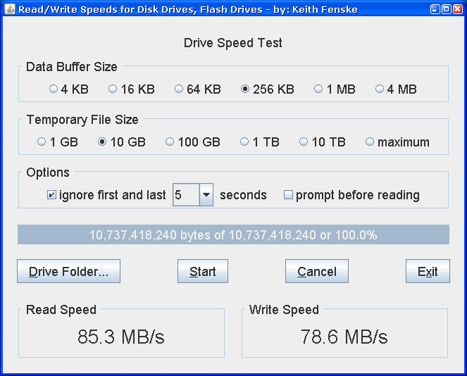

### Drive Speed (Java)

by: Keith Fenske, https://kwfenske.github.io/

DriveSpeed is a Java 1.4 graphical (GUI) application to test the speed of disk
drives or flash drives. Large temporary files are written with all zero bytes,
then read back. To get accurate results, files must be bigger than the amount
of physical memory on your computer (RAM), and should be several times bigger,
because your computer uses some of its memory as a "disk cache" to increase the
apparent speed of drives.

Download the ZIP file here: https://kwfenske.github.io/drive-speed-java.zip

Released under the terms and conditions of the Apache License (version 2.0 or
later) and/or the GNU General Public License (GPL, version 2 or later).

